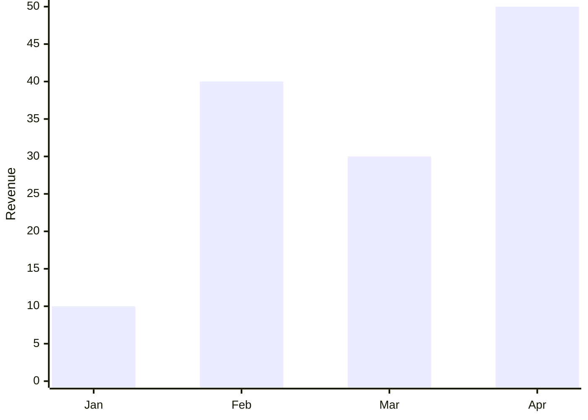
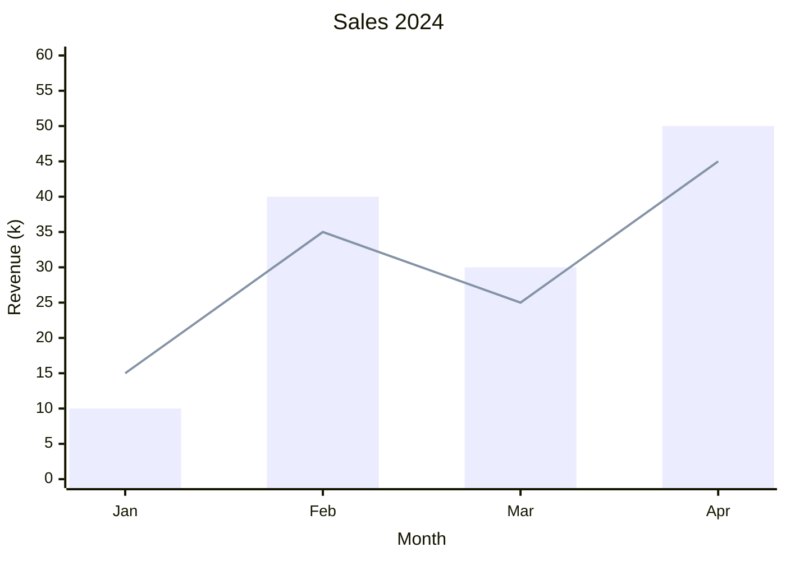

# sea-nymph

Do you want to show plots in your documentation?
Do you want to avoid committing PNGs to git?
Do you have an (un)reasonable dislike for SVG files?
Look no further!

**sea-nymph** generates [Mermaid](https://mermaid.js.org/) charts from Python — plain text that renders natively on GitHub, GitLab, and most modern documentation tools. No image files, no binary blobs, no xml.

The API is modelled after [seaborn](https://seaborn.pydata.org/): pass a DataFrame, name your columns, get a chart.

sea-nymph uses [narwhals](https://narwhals-dev.github.io/narwhals/) under the hood, so it accepts any DataFrame library — pandas, polars, PySpark, and more.
Generate your markdown charts with distributed computing.

## Installation

```bash
pip install sea-nymph
```

## High-level API

```python
import polars as pl
from sea_nymph import barplot, lineplot, countplot, histplot, kdeplot

df = pl.DataFrame({
    "month": ["Jan", "Feb", "Mar", "Apr"],
    "revenue": [10, 40, 30, 50],
    "region": ["North", "North", "South", "South"],
})

fig = barplot(df, x="month", y="revenue")
print(fig.render())
```



### Available plot functions

| Function | Description |
|---|---|
| `barplot` | Bar chart with optional aggregation |
| `lineplot` | Line chart with optional aggregation |
| `countplot` | Count (or proportion/percent) of categorical values |
| `histplot` | Histogram with configurable bins and statistics |
| `kdeplot` | Kernel density estimate using Silverman's rule |

All functions support a `hue` parameter for grouped series, `hue_order` and `order` for controlling category ordering, and `palette` for custom colours.

### Hue

```python
fig = barplot(df, x="month", y="revenue", hue="region", palette=["#4e79a7", "#f28e2b"])
```

### Stat

`countplot` and `histplot` accept a `stat` parameter:

```python
countplot(df, x="month", stat="percent")   # "count" | "percent" | "proportion" | "probability"
histplot(df, x="revenue", stat="density")  # "count" | "frequency" | "probability" | "proportion" | "percent" | "density"
```

### Horizontal charts

Pass `y` instead of `x` to flip the orientation:

```python
countplot(df, y="region")
kdeplot(df, y="revenue")
```

## Low-level API

For full control, use `XYChart` from `sea_nymph.mermaidplotlib` directly:

```python
from sea_nymph.mermaidplotlib import XYChart

months = ["Jan", "Feb", "Mar", "Apr"]
fig = XYChart()
fig.bar(months, [10, 40, 30, 50])
fig.line(months, [15, 35, 25, 45])
fig.xlabel("Month")
fig.ylabel("Revenue (k)")
fig.ylim(0, 60)
fig.title("Sales 2024")
print(fig.render())
```



## Limitations

Mermaid's `xychart-beta` places all data points equidistantly on the axis. This means:

- **Line charts** require evenly-spaced numeric x values — sea-nymph raises an error if they are not.
- **Histograms** require equal-width bins for the same reason — unequal bin widths are rejected.
