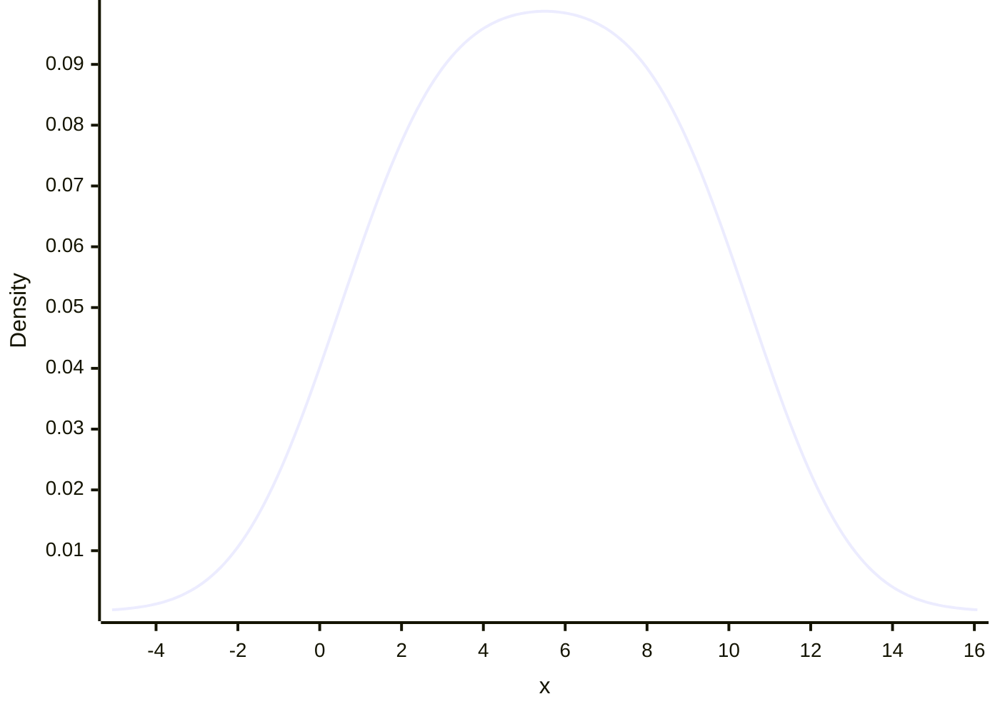

```mermaid
xychart-beta
    x-axis "x" -5.074811963246068 --> 16.07481196324607
    y-axis "Density"
    line [0.00027078792845034453, 0.00031840504541314055, 0.00037342989389237407, 0.0004368366690290523, 0.0005096973869460779, 0.0005931869362536049, 0.0006885876442691693, 0.0007972932177737355, 0.000920811908951741, 0.0010607687498030212, 0.0012189066932020932, 0.001397086496351447, 0.001597285183053611, 0.0018215929254092166, 0.0020722081935901694, 0.0023514310345359, 0.0026616543570002938, 0.003005353121470708, 0.0033850713591181084, 0.003803406974030387, 0.004262994317312346, 0.004766484559853069, 0.005316523932170288, 0.005915729944107833, 0.006566665743515403, 0.00727181282048124, 0.008033542311207299, 0.008854085202107278, 0.009735501778995702, 0.010679650707104103, 0.0116881581638813, 0.012762387476907406, 0.013903409742635927, 0.015111975917035112, 0.016388490875625633, 0.01773298993717608, 0.01914511833189468, 0.02062411407105167, 0.02216879464054351, 0.023777547896198986, 0.02544832748413784, 0.027178653046012306, 0.028965615397543866, 0.030805886790718485, 0.032695736286846244, 0.03463105018114437, 0.03660735733142115, 0.03861985915578123, 0.040663463979040776, 0.04273282532672117, 0.04482238369100647, 0.04692641122669725, 0.04903905877859452, 0.05115440459629315, 0.05326650405918478, 0.055369439714387826, 0.05745737092383254, 0.059524582423989024, 0.06156553112253812, 0.06357489049011433, 0.06554759195123631, 0.06747886273552015, 0.06936425971682283, 0.07119969884244114, 0.07298147983507644, 0.07470630593504159, 0.0763712985371261, 0.07797400666366329, 0.07951241130070023, 0.08098492470592082, 0.0823903848734245, 0.0837280454101181, 0.08499756114007831, 0.0861989698057711, 0.0873326702777448, 0.08839939771688972, 0.08940019615541787, 0.09033638897446497, 0.09120954775802735, 0.09202145999542234, 0.09277409608841157, 0.09346957609554889, 0.09411013661632187, 0.09469809818248505, 0.09523583348490607, 0.09572573672257755, 0.09617019431746676, 0.09657155719582447, 0.09693211479460326, 0.09725407091178795, 0.09753952148262837, 0.09779043433074486, 0.09800863091444807, 0.0981957700648003, 0.09835333369319599, 0.0984826144326302, 0.09858470516826884, 0.09866049040917556, 0.09871063945370426, 0.09873560130559575, 0.09873560130559575, 0.09871063945370429, 0.09866049040917559, 0.09858470516826884, 0.0984826144326302, 0.09835333369319597, 0.0981957700648003, 0.09800863091444803, 0.09779043433074486, 0.09753952148262837, 0.09725407091178796, 0.09693211479460323, 0.09657155719582446, 0.09617019431746676, 0.09572573672257755, 0.09523583348490605, 0.09469809818248502, 0.09411013661632185, 0.09346957609554886, 0.09277409608841153, 0.09202145999542229, 0.09120954775802731, 0.09033638897446492, 0.08940019615541785, 0.08839939771688966, 0.08733267027774475, 0.08619896980577106, 0.08499756114007825, 0.08372804541011804, 0.08239038487342444, 0.08098492470592077, 0.07951241130070015, 0.07797400666366322, 0.07637129853712603, 0.07470630593504154, 0.0729814798350764, 0.07119969884244104, 0.06936425971682277, 0.06747886273552006, 0.06554759195123626, 0.06357489049011426, 0.061565531122538, 0.059524582423988934, 0.057457370923832456, 0.05536943971438775, 0.053266504059184705, 0.05115440459629303, 0.04903905877859442, 0.046926411226697155, 0.0448223836910064, 0.04273282532672111, 0.04066346397904071, 0.038619859155781165, 0.03660735733142104, 0.03463105018114428, 0.03269573628684615, 0.030805886790718398, 0.028965615397543797, 0.027178653046012233, 0.02544832748413779, 0.02377754789619893, 0.022168794640543468, 0.020624114071051636, 0.0191451183318946, 0.01773298993717601, 0.016388490875625567, 0.015111975917035054, 0.013903409742635877, 0.012762387476907368, 0.011688158163881267, 0.01067965070710407, 0.009735501778995678, 0.008854085202107257, 0.008033542311207256, 0.007271812820481203, 0.006566665743515369, 0.005915729944107805, 0.005316523932170263, 0.004766484559853049, 0.004262994317312329, 0.0038034069740303725, 0.003385071359118099, 0.0030053531214706986, 0.0026616543570002773, 0.0023514310345358856, 0.002072208193590156, 0.001821592925409206, 0.001597285183053602, 0.0013970864963514405, 0.0012189066932020882, 0.0010607687498030158, 0.0009208119089517374, 0.0007972932177737285, 0.0006885876442691641, 0.0005931869362536004, 0.0005096973869460737, 0.00043683666902904935, 0.00037342989389237163, 0.0003184050454131388, 0.00027078792845034377]
```
