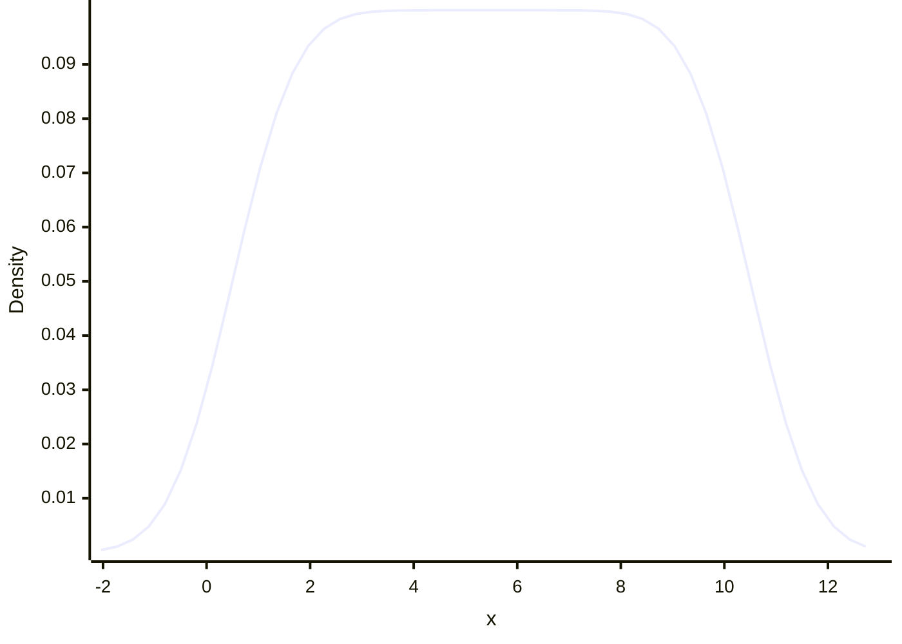

```mermaid
xychart-beta
    x-axis "x" -11.149623926492136 --> 22.149623926492136
    y-axis "Density"
    line [0.000196415625221221, 0.0003307388505293919, 0.0005426133833987584, 0.0008675059265615673, 0.0013518245488815261, 0.002053681668847794, 0.003042430283402901, 0.004396474803479088, 0.0061989742671770395, 0.00853130535308113, 0.01146452338681016, 0.015049500202901165, 0.019306840540223406, 0.024217975486985458, 0.02971890191394672, 0.03569782102876626, 0.04199743480905156, 0.04842197072924108, 0.054748269598277235, 0.06073965938176648, 0.06616099413002831, 0.07079323329705384, 0.07444624668899005, 0.0769690372258252, 0.07825710899004985, 0.07825710899004983, 0.07696903722582518, 0.07444624668899005, 0.07079323329705382, 0.06616099413002828, 0.06073965938176645, 0.05474826959827722, 0.048421970729241065, 0.04199743480905155, 0.03569782102876624, 0.02971890191394669, 0.02421797548698543, 0.019306840540223396, 0.01504950020290115, 0.011464523386810139, 0.008531305353081116, 0.006198974267177031, 0.0043964748034790845, 0.0030424302834029015, 0.002053681668847789, 0.001351824548881523, 0.0008675059265615665, 0.0005426133833987578, 0.00033073885052939194, 0.00019641562522122096]
```
