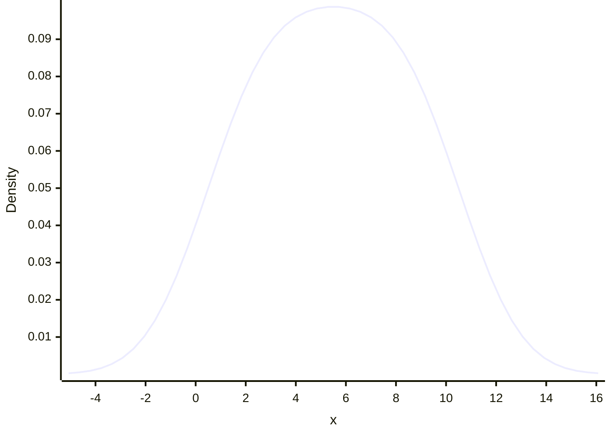

```mermaid
xychart-beta
    x-axis "x" -5.074811963246068 --> 16.07481196324607
    y-axis "Density"
    line [0.00027078792845034453, 0.0005144910425250252, 0.0009370323763740407, 0.0016366135290443616, 0.0027426337396253115, 0.004412338579905062, 0.00681927165947997, 0.010132355033719181, 0.01448688753310097, 0.019951869534658818, 0.026500818527390682, 0.03399437922360033, 0.04218161080584389, 0.05072277132308625, 0.05923074728224046, 0.06732286973488608, 0.07467169441590987, 0.08104360944079303, 0.0863177457518108, 0.0904832061530931, 0.09361807462659615, 0.09585725821222175, 0.09735713738395024, 0.09826357629270774, 0.09868718969345745, 0.09868718969345747, 0.09826357629270772, 0.09735713738395023, 0.09585725821222174, 0.09361807462659613, 0.09048320615309306, 0.08631774575181073, 0.08104360944079293, 0.07467169441590982, 0.06732286973488602, 0.0592307472822404, 0.050722771323086176, 0.042181610805843824, 0.033994379223600275, 0.02650081852739063, 0.01995186953465877, 0.014486887533100928, 0.010132355033719146, 0.0068192716594799455, 0.004412338579905046, 0.002742633739625301, 0.0016366135290443542, 0.0009370323763740365, 0.0005144910425250233, 0.00027078792845034377]
```
