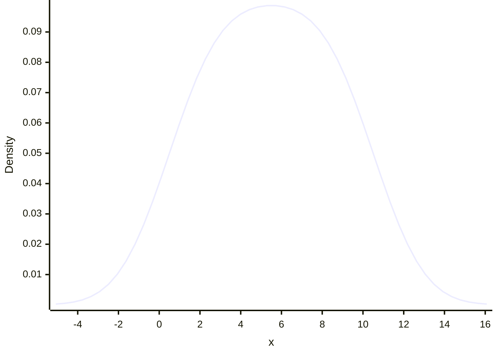

```mermaid
xychart-beta
    x-axis "x" 1 --> 10
    y-axis "Density"
    line [0.059850623689055145, 0.06334964400488512, 0.06674098981112762, 0.07000047937279752, 0.07310702428302464, 0.07604301033153443, 0.07879454578702746, 0.08135157320140736, 0.0837078475242861, 0.08586078941360042, 0.08781122778430932, 0.0895630495872176, 0.09112277739804653, 0.09249909658079696, 0.09370235363554322, 0.09474404600960706, 0.0956363213762578, 0.09639150144797348, 0.0970216420936988, 0.09753813816746, 0.09795137829604905, 0.09827045213529285, 0.09850291044559821, 0.09865457684752069, 0.09872940931657267, 0.0987294093165727, 0.09865457684752069, 0.09850291044559821, 0.09827045213529284, 0.09795137829604904, 0.09753813816746, 0.0970216420936988, 0.09639150144797345, 0.09563632137625781, 0.09474404600960706, 0.0937023536355432, 0.09249909658079696, 0.09112277739804653, 0.0895630495872176, 0.08781122778430932, 0.08586078941360041, 0.08370784752428607, 0.08135157320140735, 0.07879454578702746, 0.0760430103315344, 0.07310702428302464, 0.07000047937279752, 0.06674098981112764, 0.06334964400488509, 0.05985062368905514]
```


