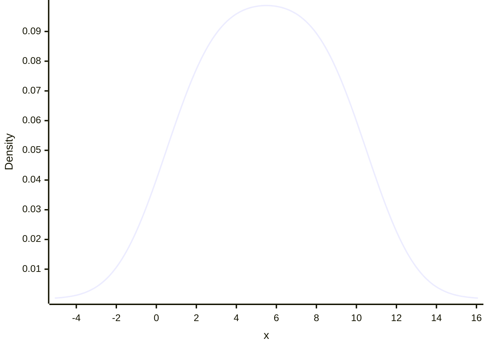

```mermaid
xychart-beta
    x-axis "x" -5.074811963246068 --> 16.07481196324607
    y-axis "Density"
    line [0.00027078792845034453, 0.0003184050454131408, 0.0003734298938923741, 0.0004368366690290523, 0.0005096973869460784, 0.000593186936253605, 0.0006885876442691693, 0.0007972932177737359, 0.0009208119089517414, 0.0010607687498030212, 0.0012189066932020945, 0.0013970864963514476, 0.001597285183053611, 0.0018215929254092175, 0.0020722081935901702, 0.0023514310345359004, 0.0026616543570002955, 0.003005353121470709, 0.0033850713591181084, 0.00380340697403039, 0.004262994317312346, 0.00476648455985307, 0.005316523932170288, 0.005915729944107834, 0.0065666657435154065, 0.00727181282048124, 0.0080335423112073, 0.00885408520210728, 0.009735501778995705, 0.010679650707104107, 0.011688158163881303, 0.01276238747690741, 0.013903409742635929, 0.015111975917035112, 0.016388490875625637, 0.017732989937176084, 0.01914511833189468, 0.02062411407105167, 0.02216879464054351, 0.023777547896198986, 0.025448327484137848, 0.02717865304601231, 0.028965615397543873, 0.03080588679071848, 0.032695736286846244, 0.03463105018114438, 0.036607357331421155, 0.03861985915578123, 0.040663463979040776, 0.042732825326721194, 0.04482238369100647, 0.04692641122669725, 0.04903905877859452, 0.05115440459629313, 0.053266504059184774, 0.05536943971438782, 0.057457370923832546, 0.059524582423989024, 0.06156553112253812, 0.06357489049011433, 0.06554759195123631, 0.06747886273552015, 0.06936425971682283, 0.07119969884244112, 0.07298147983507645, 0.0747063059350416, 0.0763712985371261, 0.07797400666366329, 0.07951241130070023, 0.08098492470592084, 0.0823903848734245, 0.0837280454101181, 0.08499756114007831, 0.08619896980577113, 0.0873326702777448, 0.08839939771688972, 0.08940019615541789, 0.09033638897446497, 0.09120954775802737, 0.09202145999542231, 0.09277409608841158, 0.09346957609554887, 0.0941101366163219, 0.09469809818248506, 0.0952358334849061, 0.09572573672257757, 0.09617019431746678, 0.09657155719582447, 0.09693211479460326, 0.09725407091178795, 0.09753952148262837, 0.09779043433074486, 0.09800863091444804, 0.0981957700648003, 0.09835333369319599, 0.09848261443263023, 0.09858470516826884, 0.09866049040917559, 0.09871063945370429, 0.09873560130559575, 0.09873560130559575, 0.09871063945370429, 0.09866049040917556, 0.09858470516826884, 0.09848261443263023, 0.09835333369319597, 0.0981957700648003, 0.09800863091444804, 0.09779043433074486, 0.09753952148262837, 0.09725407091178795, 0.09693211479460323, 0.09657155719582447, 0.09617019431746676, 0.09572573672257755, 0.09523583348490607, 0.09469809818248502, 0.09411013661632187, 0.09346957609554886, 0.09277409608841154, 0.09202145999542229, 0.09120954775802731, 0.09033638897446492, 0.08940019615541785, 0.08839939771688968, 0.08733267027774476, 0.08619896980577106, 0.08499756114007825, 0.08372804541011804, 0.08239038487342444, 0.08098492470592078, 0.07951241130070015, 0.07797400666366323, 0.07637129853712603, 0.07470630593504154, 0.0729814798350764, 0.07119969884244104, 0.06936425971682277, 0.06747886273552005, 0.06554759195123626, 0.06357489049011426, 0.061565531122538014, 0.059524582423988934, 0.057457370923832456, 0.05536943971438776, 0.053266504059184705, 0.05115440459629303, 0.04903905877859443, 0.04692641122669716, 0.0448223836910064, 0.042732825326721124, 0.04066346397904071, 0.03861985915578117, 0.03660735733142104, 0.03463105018114428, 0.03269573628684615, 0.0308058867907184, 0.0289656153975438, 0.027178653046012236, 0.02544832748413779, 0.02377754789619893, 0.022168794640543468, 0.020624114071051636, 0.019145118331894608, 0.01773298993717601, 0.016388490875625574, 0.015111975917035057, 0.013903409742635878, 0.012762387476907368, 0.011688158163881269, 0.010679650707104074, 0.009735501778995676, 0.008854085202107261, 0.008033542311207259, 0.007271812820481203, 0.006566665743515373, 0.005915729944107807, 0.005316523932170263, 0.004766484559853051, 0.00426299431731233, 0.003803406974030375, 0.003385071359118099, 0.0030053531214706995, 0.002661654357000279, 0.0023514310345358856, 0.0020722081935901564, 0.001821592925409207, 0.0015972851830536024, 0.001397086496351441, 0.0012189066932020891, 0.001060768749803016, 0.0009208119089517379, 0.0007972932177737293, 0.0006885876442691642, 0.0005931869362536005, 0.0005096973869460743, 0.00043683666902904935, 0.0003734298938923717, 0.00031840504541313903, 0.00027078792845034377]
```
