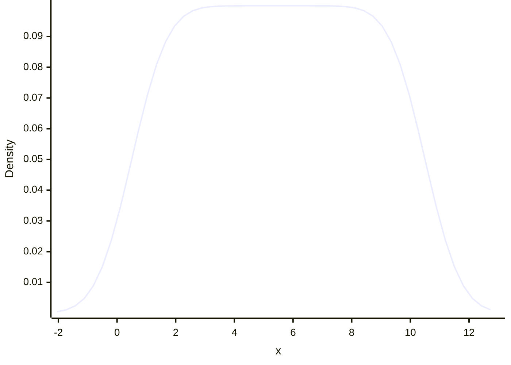

```mermaid
xychart-beta
    x-axis "x" -11.149623926492136 --> 22.149623926492136
    y-axis "Density"
    line [0.0001964156252212211, 0.00033073885052939227, 0.0005426133833987589, 0.0008675059265615676, 0.0013518245488815261, 0.0020536816688477948, 0.0030424302834029036, 0.004396474803479089, 0.00619897426717704, 0.00853130535308113, 0.01146452338681016, 0.015049500202901162, 0.01930684054022341, 0.02421797548698546, 0.029718901913946726, 0.03569782102876626, 0.04199743480905157, 0.048421970729241086, 0.05474826959827725, 0.06073965938176649, 0.06616099413002831, 0.07079323329705382, 0.07444624668899005, 0.0769690372258252, 0.07825710899004984, 0.07825710899004984, 0.07696903722582518, 0.07444624668899004, 0.07079323329705382, 0.0661609941300283, 0.06073965938176647, 0.054748269598277215, 0.048421970729241065, 0.041997434809051555, 0.03569782102876624, 0.029718901913946695, 0.024217975486985434, 0.0193068405402234, 0.015049500202901151, 0.01146452338681014, 0.008531305353081116, 0.006198974267177032, 0.004396474803479085, 0.0030424302834029036, 0.0020536816688477896, 0.0013518245488815235, 0.0008675059265615666, 0.0005426133833987582, 0.00033073885052939227, 0.0001964156252212211]
```
